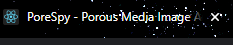

# PoreSpy Frontend Documentation

## Development Tools

- VS Code (any text editor is fine, but it is suggested to use one with a built in terminal)
- Git
- Github
- npm
- create-react-app (this project was started with create-react-app since specific Babel and webpack configurations were deemed unnecessary. However if this changes in the future, the code in the `src` folder should still work. Babel is the javascript compiler that allows ES6 code to be backwards compatible with javascript, allowing it to be rendered by the browser. Webpackk is a javascript module bundler. Both Babel and webpack settings are abstracted using create-react-app).

## Folder Structure Explanation

Once the repo has been pulled and the `npm install` command has been run, the following folder structure should appear at the root directory of the project:

- `node_modules`
- `public`
- `src`

## node_modules

The `node_modules` folder contains all the necessary node modules for the frontend run. Notable packages include axios (for making http requests to the backend (the RESTful API)), react-redux (for maintaining globalized state variables), and electron (useful for deployment into a desktop app using electron.js). The `node_modules` folder contains all default and installed packages. A more concise list of all the installed packages can be found in `package.json` in the `"dependencies"` property. 

**NOTE:** Please be wary of any changes made tot he `package.json` and `package-lock.json` files, as invalid changes can cause compilation errors for the frontend.

## public

The `public` folder contains three important files: `favicon.ico`, `index.html`, `manifest.json`. `favicon.ico` is the favicon file, which is an image the browser renders as the webpage's icon. It looks like this: 

This icon be changed, but make sure that the image has the .ico extension for it to be rendered. The `index.html` file is what the browser is ultimately rendering. Browsers do not understand React, and jsx, so they show what is stored in `.html` and `.js` files. The part of `index.html` that displays the React code is `

`. The `src/index.js` file (the entry point of the React code) uses ReactDOM to render the jsx into a `

` tag with id of "root" in `index.html`.

`ReactDOM.render(jsx, document.getElementById('root'));`

`manifest.json` allows the developer to dynamically store favicon.ico and other image files in JSON format to display them in the `index.html` file.

## src

The `src` folder contains the source code for the frontend. Most changes that will be displayed directly on the frontend will be to files inside this folder.

